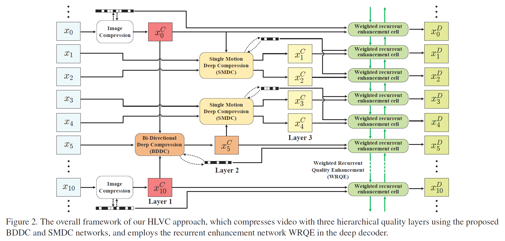

# Learning for Video Compression with Hierarchical Quality and Recurrent Enhancement

The project page for the paper:

Ren Yang, Fabian Mentzer, Luc Van Gool and Radu Timofte, "Learning for Video Compression with Hierarchical Quality and Recurrent Enhancement", in IEEE/CVF Conference on Computer Vision and Pattern Recognition (CVPR), 2020. [[Paper]](https://arxiv.org/abs/2003.01966). 

Email: ren.yang@vision.ee.ethz.ch

Citation:
```
@inproceedings{yang2020Learning,
  title={Learning for Video Compression with Hierarchical Quality and Recurrent Enhancement},
  author={Yang, Ren and Mentzer, Fabian and Van Gool, Luc and Timofte, Radu},
  booktitle={Proceedings of the IEEE/CVF Conference on Computer Vision and Pattern Recognition (CVPR)},
  year={2020}
}
```
## Introduction


This paper proposes a Hierarchical Learned Video Compression (HLVC) method with three hierarchical quality layers and a recurrent enhancement network. As illustrated in Figure 1, the frames in layers 1, 2 and 3 are compressed with the highest, medium and the lowest quality, respectively. The benefits of hierarchical quality are two-fold: First, the high quality frames, which provide high quality references, are able to improve the compression performance of other frames at the encoder side; Second, because of the high correlation among neighboring frames, at the decoder side, the low quality frames can be enhanced by making use of the advantageous information in high quality frames. The enhancement improves quality without bit-rate overhead, thus improving the rate-distortion performance. For example, the frames 3 and 8 in Figure 1, which belong to layer 3, are compressed with low quality and bit-rate. Then, our recurrent enhancement network significantly improves their quality, taking advantage of higher quality frames, e.g., frames 0 and 5. As a result, the frames 3 and 8 reach comparable quality to frame 5 in layer 2, but consume much less bit-rate. Therefore, our HLVC approach achieves efficient video compression.



The framework of our HLVC is shown in Figure 2, in which we use image compression method to compression layer 1. For layer 2, we propose the Bi-Directional Deep Compression (BDDC) network, which uses the compressed frames of layer 1 as bi-directional references. Then, because of the correlation between motions of neighboring frames, we propose compressing layer 3 by our Single Motion Deep Compression (SMDC) network. The SMDC network applies a single motion map to estimate motions among several frames to reduce the bit-rate for encoding motion maps. Finally, we develop the Weighted Recurrent Quality Enhancement (WRQE) network, in which the recurrent cells are weighted by quality features to reasonably apply multi-frame information for recurrent enhancement.

## Performance
### Settings
We test our HLVC approach on the JCT-VC (Classes B, C and D) and the [UVG](http://ultravideo.cs.tut.fi/#testsequences) datasets. Among them, the UVG and JCT-VC Class B are high resolution (1920 x 1080) datasets, and the JCT-VC Classes C and D have resolutions of 832 x 480 and 416 x 240, respectively. In our approach, the entropy model requires each dimension to be a multiple of 16, and therefore we crop the 1920 x 1080 videos to 1920 x 1072 by cutting the bottom 8 pixels. For a fair comparison with [Lu *et al.*, DVC](http://openaccess.thecvf.com/content_CVPR_2019/papers/Lu_DVC_An_End-To-End_Deep_Video_Compression_Framework_CVPR_2019_paper.pdf), we follow Lu *et al.*, DVC to test JCT-VC videos on the first 100 frames, and test UVG videos on all frames. Note that, the [UVG](http://ultravideo.cs.tut.fi/#testsequences) dataset has been enlarged recently. To compare with previous approaches, we only test on the original 7 videos in UVG, i.e., *Beauty*, *Bosphorus*, *HoneyBee*, *Jockey*, *ReadySetGo*, *ShakeNDry* and *YachtRide*.

We calculate the Bjøntegaard-Delta Bit-Rate (BDBR) values with the anchor of *x265 LDP very fast*, which is implemented by the following command with Quality = 15, 19, 23, 27 for the JCT-VC dataset, and Quality = 11, 15, 19, 23 for UVG videos (to make the bit-rate range reasonable for comparison).
```
ffmpeg -pix_fmt yuv420p -s WidthxHeight -r Framerate  -i  Name.yuv -vframes Frame -c:v libx265 -preset veryfast -tune zerolatency -x265-params "crf=Quality:keyint=10:verbose=1" Name.mkv
```
### Results
The detailed results (bpp, PSNR and MS-SSIM values) on each video sequence are shown in [data.xlsx](/Results). The BDBR values can be calculated by the [Matlab implementation](https://www.mathworks.com/matlabcentral/fileexchange/41749-bjontegaard-metric-calculation-bd-psnr) or the [Python implementation](https://github.com/Anserw/Bjontegaard_metric). The results are shown in Table 1, where we first calculate BDBR on each sequence, and then take the average value on each dataset. Besides, the rate-distortion curves are shown below in Figure 6. It can be seen that our HLVC approach outperforms all previous learned video compression methods and the *x265 LDP very fast* anchor. The visual results of HLVC and the *x265 LDP very fast* anchor are shown in Figure 13.


