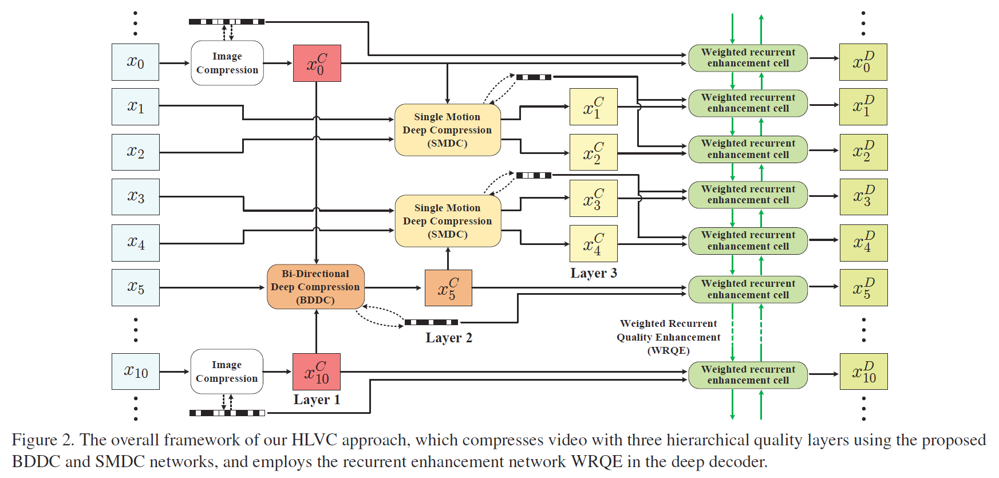

# Learning for Video Compression with Hierarchical Quality and Recurrent Enhancement

The project page for the paper:

Ren Yang, Fabian Mentzer, Luc Van Gool and Radu Timofte, "Learning for Video Compression with Hierarchical Quality and Recurrent Enhancement", in IEEE/CVF Conference on Computer Vision and Pattern Recognition (CVPR), 2020.

The camera-ready paper is at [https://arxiv.org/abs/2003.01966](https://arxiv.org/abs/2003.01966).

Citation:
```
@inproceedings{yang2020Learning,
  title={Learning for Video Compression with Hierarchical Quality and Recurrent Enhancement},
  author={Yang, Ren and Mentzer, Fabian and Van Gool, Luc and Timofte, Radu},
  booktitle={Proceedings of the IEEE Conference on Computer Vision and Pattern Recognition (CVPR)},
  year={2020}
}
```
## Introduction


  This paper proposes a Hierarchical Learned Video Compression (HLVC) method with three hierarchical quality layers and a recurrent enhancement network. As illustrated in Figure 1, the frames in layers 1, 2 and 3 are compressed with the highest, medium and the lowest quality, respectively. The benefits of hierarchical quality are two-fold: First, the high quality frames, which provide high quality references, are able to improve the compression performance of other frames at the encoder side; Second, because of the high correlation among neighboring frames, at the decoder side, the low quality frames can be enhanced by making use of the advantageous information in high quality frames. The enhancement improves quality without bit-rate overhead, thus improving the rate-distortion performance. For example, the frames 3 and 8 in Figure 1, which belong to layer 3, are compressed with low quality and bit-rate. Then, our recurrent enhancement network significantly improves their quality, taking advantage of higher quality frames, e.g., frames 0 and 5. As a result, the frames 3 and 8 reach comparable quality to frame 5 in layer 2, but consume much less bit-rate. Therefore, our HLVC approach achieves efficient video compression.



  The framework of our HLVC is shown in Figure 2, in which we use image compression method to compression layer 1. For layer 2, we propose the Bi-Directional Deep Compression (BDDC) network, which uses the compressed frames of layer 1 as bi-directional references. Then, because of the correlation between motions of neighboring frames, we propose compressing layer 3 by our Single Motion Deep Compression (SMDC) network. The SMDC network applies a single motion map to estimate motions among several frames to reduce the bit-rate for encoding motion maps. Finally, we develop the Weighted Recurrent Quality Enhancement (WRQE) network, in which the recurrent cells are weighted by quality features to reasonably apply multi-frame information for recurrent enhancement.

## Performance

## Contact

Email: ren.yang@vision.ee.ethz.ch

WeChat: yangren93
