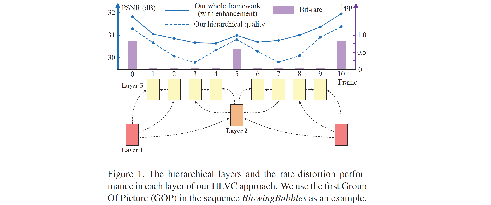
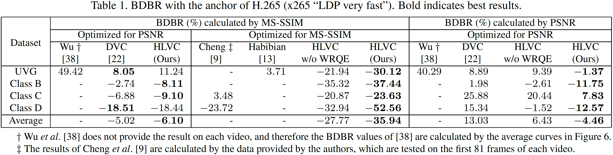
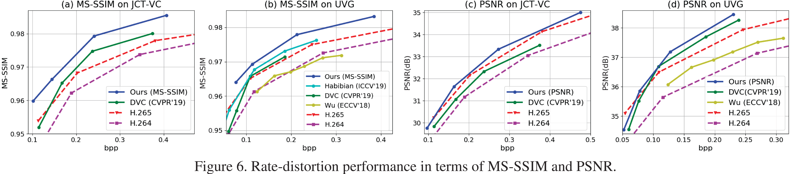

Our latest works on learned video compression:

- Recurrent Learned Video Compression (RLVC) [[Paper](https://arxiv.org/abs/2006.13560)]

- OpenDVC: An open source implementation of DVC [[Codes](https://github.com/RenYang-home/OpenDVC)] [[Technical report](https://arxiv.org/abs/2006.15862)]

# Learning for Video Compression with Hierarchical Quality and Recurrent Enhancement

 **We corrected two models in our [pre-trained models](https://drive.google.com/drive/folders/1JWRIp7RgZZEulrUfQAlbAnAkA6MAKRbE?usp=sharing), if you downloaded them before July 5, 2020, please re-download the folders "HLVC_model\Layer2_B-frame\Layer2_B_MS-SSIM_64_model" and "HLVC_model\Layer3_BP-frame\Layer3_BP_PSNR_2048_aroundlayer1". We are sorry for the inconvinience.**

The project page for the paper:

> Ren Yang, Fabian Mentzer, Luc Van Gool and Radu Timofte, "Learning for Video Compression with Hierarchical Quality and Recurrent Enhancement", in IEEE/CVF Conference on Computer Vision and Pattern Recognition (CVPR), 2020. [[Paper]](https://arxiv.org/abs/2003.01966). 

If our paper and codes are useful for your research, please cite:
```
@inproceedings{yang2020Learning,
  title={Learning for Video Compression with Hierarchical Quality and Recurrent Enhancement},
  author={Yang, Ren and Mentzer, Fabian and Van Gool, Luc and Timofte, Radu},
  booktitle={Proceedings of the IEEE/CVF Conference on Computer Vision and Pattern Recognition (CVPR)},
  year={2020}
}
```

If you have any questioon or find any bug, please feel free to contact:

Ren Yang @ ETH Zurich, Switzerland   

Email: ren.yang@vision.ee.ethz.ch

## Introduction



This paper proposes a Hierarchical Learned Video Compression (HLVC) method with three hierarchical quality layers and a recurrent enhancement network. As illustrated in Figure 1, the frames in layers 1, 2 and 3 are compressed with the highest, medium and the lowest quality, respectively. The benefits of hierarchical quality are two-fold: First, the high quality frames, which provide high quality references, are able to improve the compression performance of other frames at the encoder side; Second, because of the high correlation among neighboring frames, at the decoder side, the low quality frames can be enhanced by making use of the advantageous information in high quality frames. The enhancement improves quality without bit-rate overhead, thus improving the rate-distortion performance. For example, the frames 3 and 8 in Figure 1, which belong to layer 3, are compressed with low quality and bit-rate. Then, our recurrent enhancement network significantly improves their quality, taking advantage of higher quality frames, e.g., frames 0 and 5. As a result, the frames 3 and 8 reach comparable quality to frame 5 in layer 2, but consume much less bit-rate. Therefore, our HLVC approach achieves efficient video compression.

## Codes

We provide the codes for compressing video frame in various manners, i.e.,

- HLVC_layer2_P-frame(_decoder).py -- Long-distance P-frame with high quality (layer 2)
- HLVC_layer2_B-frame(_decoder).py -- Long-distance B-frame with high quality (layer 2)
- HLVC_layer3_P-frame(_decoder).py -- Short-distance P-frame with low quality (layer 3)
- HLVC_layer3_BP-frame(_decoder).py -- BP-frames combination with low quality (layer 3), using the "single frame" strategy. It includes the compression of medium-distance P-frame and short-distance B-frame.

Thay can be flexibly combined to achieve different frame structures and GOP sizes.

We also provide the demo codes for compress a video sequence, i.e., 

- HLVC_video_fast.py
- HLVC_video_slow.py
- HLVC_video_decoder.py

### Preperation

We feed RGB images into the our encoder. To compress a YUV video, please first convert to PNG images with the following command.

```
ffmpeg -pix_fmt yuv420p -s WidthxHeight -i Name.yuv -vframes Frame path_to_PNG/f%03d.png
```

Note that, our HLVC codes currently only supports the frames with the height and width as the multiples of 16. Therefore, when using these codes, if the height and width of frames are not the multiples of 16, please first crop frames, e.g.,

```
ffmpeg -pix_fmt yuv420p -s 1920x1080 -i Name.yuv -vframes Frame -filter:v "crop=1920:1072:0:0" path_to_PNG/f%03d.png
```

We uploaded a prepared sequence *BasketballPass* here as a test demo, which contains the PNG files of the first 101 frames. Note that, ffmpeg generates frames starting from f001.png in the folder "BasketballPass", while in Figure 1, the frame index begins from 0.

### Dependency

- Tensorflow 1.12

- Tensorflow-compression 1.0 ([Download link](https://github.com/tensorflow/compression/releases/tag/v1.0))

  (*After downloading, put the folder "tensorflow_compression" to the same directory as the codes.*)

- Pre-trained models ([Download link](https://drive.google.com/drive/folders/1JWRIp7RgZZEulrUfQAlbAnAkA6MAKRbE?usp=sharing))

  (*Download the folder "HLVC_model" to the same directory as the codes.*)

- BPG ([Download link](https://bellard.org/bpg/))  -- needed only for the PSNR model

  (*In our PSNR model, we use BPG to compress I-frames instead of training learned image compression models.*)

- Context-adaptive image compression model, Lee et al., ICLR 2019 ([Paper](https://arxiv.org/abs/1809.10452), [Model](https://github.com/JooyoungLeeETRI/CA_Entropy_Model)) -- needed only for the MS-SSIM model

  (*In our MS-SSIM model, we use Lee et al., ICLR 2019 to compress I-frames.*)

### Compressing frame

- **HLVC_layer2_P-frame(_decoder).py**

```
--ref, reference frame.

--raw, the raw frame to be compressed. (only in the encoder)

--com, the path to save the compressed/decompressed frame.

--bin, the path to save/read the compressed bitstream.

--mode, select the PSNR/MS-SSIM optimized model.

--l, the lambda value. For layer 2, l = 32, 64, 128 and 256 for MS-SSIM, and l = 1024, 2048, 4096 and 8192 for PSNR.
```

For example,
```
python HLVC_layer2_P-frame.py --ref f001_com.png --raw f006.png --com f006_com.png --bin f006.bin --mode PSNR --l 4096
```
```
python HLVC_layer2_P-frame_decoder.py --ref f001_com.png --bin f006.bin --com f006_dec.png --mode PSNR --l 4096
```

- **HLVC_layer2_B-frame(_decoder).py**

Similar to HLVC_layer2_P-frame(_decoder).py but needs two reference frames.

For example,
```
python HLVC_layer2_B-frame.py --ref_1 f001_com.png --ref_2 f011_com.png --raw f006.png --com f006_com.png --bin f006.bin --mode PSNR --l 4096
```
```
python HLVC_layer2_B-frame_decoder.py --ref_1 f001_com.png --ref_2 f011_com.png --bin f006.bin --com f006_dec.png --mode PSNR --l 4096
```

- **HLVC_layer3_P-frame(_decoder).py**

The same network as HLVC_layer2_P-frame(_decoder).py. Since we use BPG to compressed I-frames for the PSNR model and BPG has different distortion features from learned compressed, we train two PSNR models for the Layer 3 frames near from Layer 1 (I-frames) and near from layer 2. That is,
```
parser.add_argument("--nearlayer", type=int, default=1, choices=[1, 2]) # not used in MS-SSIM models
```
For example, in Figure 1, the frames 1, 2, 8 and 9 are near layer 1 and the frames 3, 4, 6 and 7 are near layer 2. Note that, for layer 3, lambda = 8, 16, 32 and 64 for MS-SSIM, and lambda = 256, 512, 1024 and 2048 for PSNR.

- **HLVC_layer3_BP-frame(_decoder).py**

The combination of short distance B- and P-frames, using the "single motion" strategy proposed in Section 3.3 of our paper. 
```
--ref, reference frame.

--raw_1, the raw frame (next to reference) to be compressed. (only in the encoder)

--raw_2, the raw frame (next to --raw_1) to be compressed. (only in the encoder)

--com_1, the path to save the compressed/decompressed frame of --raw_1.

--com_2, the path to save the compressed/decompressed frame of --raw_2.

--bin, the path to save/read the compressed bitstream.

--nearlayer, the same as that in HLVC_layer3_P-frame(_decoder).py. (only for PSNR models)

--mode, select the PSNR/MS-SSIM optimized model.

--l, the lambda value. For layer 3, l = 8, 16, 32 and 64 for MS-SSIM, and l = 256, 512, 1024 and 2048 for PSNR.
```

For example,
```
python HLVC_layer3_BP-frame.py --ref f001_com.png --raw_1 f001.png --com_1 f001_com.png --raw_2 f002.png --com_2 f002_com.png --bin f001_002.bin --nearlayer 1 --mode PSNR --l 1024
```
```
python HLVC_layer3_BP-frame_decoder.py --ref f001_com.png --com_1 f001_com.png --com_2 f002_com.png --bin f001_002.bin --nearlayer 1 --mode PSNR --l 1024
```

### Compressing video

- **HLVC_video_fast/slow.py** (currently not including the enhancement network WRQE)

We provide two demo codes for compressing a video sequence. In HLVC_video_fast.py, the B-frames are used for layer 2 and the BP-frames combination is used for layer 3. In HLVC_video_slow, we try different networks for compresseing layers 2 and 3 in an exhaustive manner, and select the best performed network. This way, the performance can be improved at the cost of higher complexity. To compare two compression networks, in the case of Quality_2 - Quality_1 > 0 and bpp_2 - bpp_1 > 0, if (Quality_2 - Quality_1)/(bpp_2 - bpp_1) > threshold, the 2nd network is considered as the better one. We empirically set the threshold as 10 for PSNR (dB) and 0.1 for MS-SSIM index. 

HLVC_video_fast/slow.py has the following auguments:
```
--path, the path to the PNG files.

--frame, the total frame, should be GOP (=10) * n + 1, e.g., 101.

--mode, PSNR or MS-SSIM.

--python_path, the path to python (only used for MS-SSIM model to run Lee et al., ICLR 2019 on I-frames);

--CA_model_path, the path to CA_EntropyModel_Test of Lee et al., ICLR 2019 (only used for MS-SSIM model);

--l, lambda value. l = 256, 512, 1024 and 2048 for PSNR, and l = 8, 16, 32 and 64 for MS-SSIM.

```
For example,
```
python HLVC_video_fast/slow.py --path BasketballPass --frame 101 --mode PSNR --l 1024
```

- **HLVC_video_decoder.py** (currently not including the enhancement network WRQE)

```
--path_bin, the path to the bin files (bitstreams).

--frame, the total frame, should be GOP (=10) * n + 1, e.g., 101.

--mode, PSNR or MS-SSIM.

--python_path, the path to python (only used for MS-SSIM model to run Lee et al., ICLR 2019 on I-frames);

--CA_model_path, the path to CA_EntropyModel_Test of Lee et al., ICLR 2019 (only used for MS-SSIM model);

--l, lambda value. l = 256, 512, 1024 and 2048 for PSNR, and l = 8, 16, 32 and 64 for MS-SSIM.

```
For example,
```
python HLVC_video_decoder.py --path_bin BasketballPass_com_slow_PSNR_1024 --frame 101 --mode PSNR --l 1024
```

### To do

Release the codes of the enhancement network WRQE.


## Performance
### Settings
We test our HLVC approach on the JCT-VC (Classes B, C and D) and the [UVG](http://ultravideo.cs.tut.fi/#testsequences) datasets. Among them, the UVG and JCT-VC Class B are high resolution (1920 x 1080) datasets, and the JCT-VC Classes C and D have resolutions of 832 x 480 and 416 x 240, respectively. For a fair comparison with [Lu *et al.*, DVC](http://openaccess.thecvf.com/content_CVPR_2019/papers/Lu_DVC_An_End-To-End_Deep_Video_Compression_Framework_CVPR_2019_paper.pdf), we follow Lu *et al.*, DVC to test JCT-VC videos on the first 100 frames, and test UVG videos on all frames. Note that, the [UVG](http://ultravideo.cs.tut.fi/#testsequences) dataset has been enlarged recently. To compare with previous approaches, we only test on the original 7 videos in UVG, i.e., *Beauty*, *Bosphorus*, *HoneyBee*, *Jockey*, *ReadySetGo*, *ShakeNDry* and *YachtRide*.

In our approach, the entropy model requires each dimension to be a multiple of 16, and therefore we crop the 1920 x 1080 videos to 1920 x 1072 by cutting the bottom 8 pixels, using the following command.
```
ffmpeg -pix_fmt yuv420p -s WidthxHeight -i Name.yuv -filter:v "crop=1920:1072:0:0" Name_crop.yuv
```
We calculate the Bjøntegaard-Delta Bit-Rate (BDBR) values with the anchor of *x265 LDP very fast*, which is implemented by the following command with Quality = 15, 19, 23, 27 for the JCT-VC dataset, and Quality = 11, 15, 19, 23 for UVG videos (to make the bit-rate range reasonable for comparison).
```
ffmpeg -pix_fmt yuv420p -s WidthxHeight -r Framerate  -i  Name.yuv -vframes Frame -c:v libx265 -preset veryfast -tune zerolatency -x265-params "crf=Quality:keyint=10:verbose=1" Name.mkv
```
### Results
The detailed results (bpp, PSNR and MS-SSIM values) on each video sequence are shown in [data.xlsx](/Results). The BDBR values can be calculated by the [Matlab implementation](https://www.mathworks.com/matlabcentral/fileexchange/41749-bjontegaard-metric-calculation-bd-psnr) or the [Python implementation](https://github.com/Anserw/Bjontegaard_metric). The results are shown in Table 1, where we first calculate BDBR on each sequence, and then take the average value on each dataset. Besides, the rate-distortion curves are shown below in Figure 6. It can be seen that our HLVC approach outperforms all previous learned video compression methods and the *x265 LDP very fast* anchor. The visual results of HLVC and the *x265 LDP very fast* anchor are shown in Figure 13.






